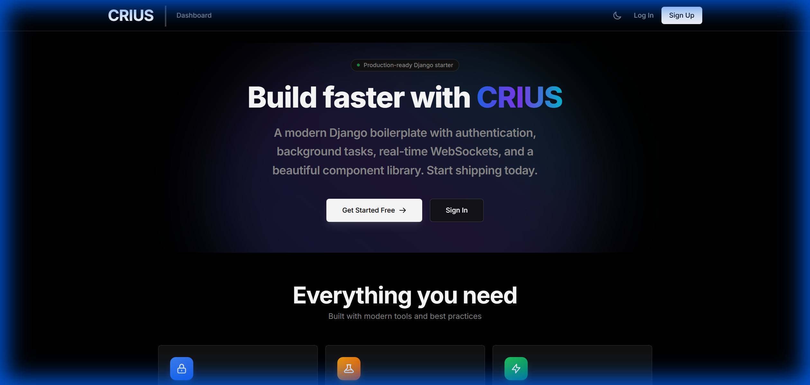
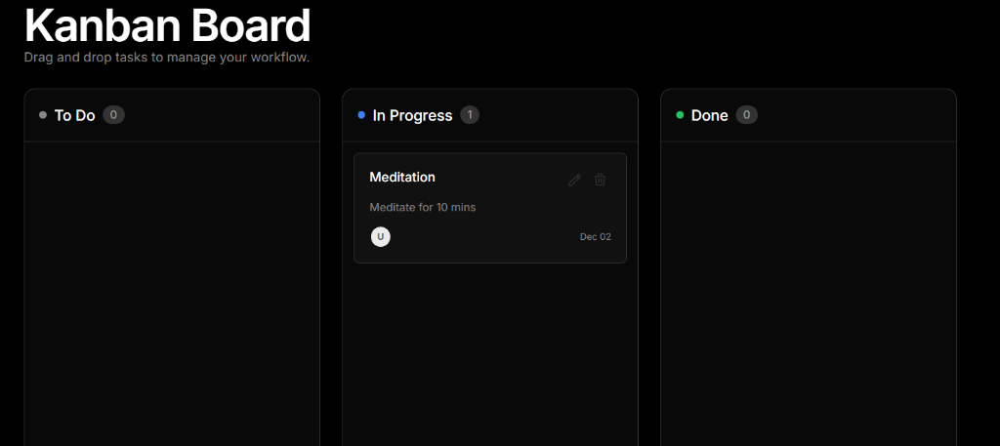
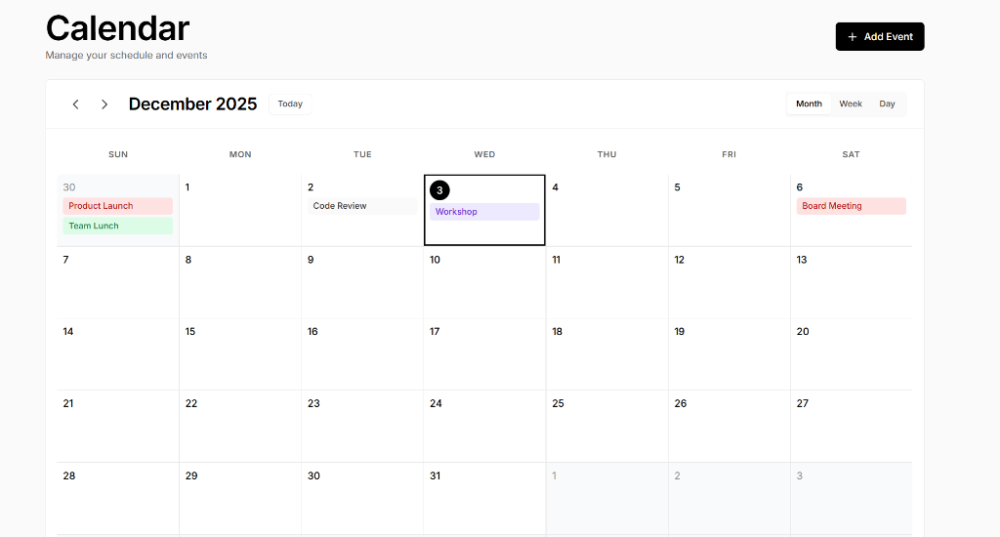
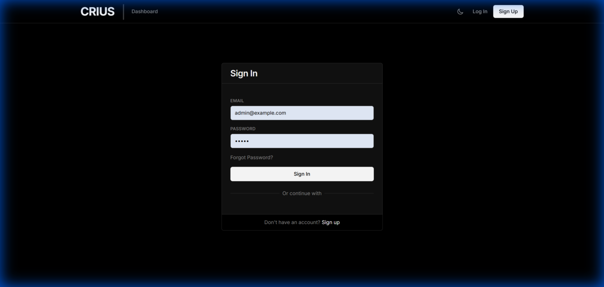

# Django Enterprise Boilerplate (CRIUS)

A modern, production-ready Django boilerplate built for speed, scalability, and developer experience. It comes pre-configured with a robust tech stack and essential features to kickstart your next web application.

## 🚀 Features

*   **Modern UI/UX**: Built with **Tailwind CSS** and **Alpine.js**, featuring a clean "Geist" inspired design system.
*   **Authentication**: Complete user authentication system using `django-allauth`, including:
    *   Login, Registration, Password Reset.
    *   **Two-Factor Authentication (2FA)** with TOTP (Google Authenticator).
*   **Dashboard**: A responsive dashboard layout with sidebar navigation and breadcrumbs.
*   **Task Management**:
    *   **Kanban Board**: Drag-and-drop task management with dynamic updates.
    *   **Todo List**: Simple task tracking.
*   **Calendar**: Interactive calendar with Month and Day views, supporting event management.
*   **Async Processing**: Pre-configured **Celery** and **Redis** for background tasks and scheduled jobs (Celery Beat).
*   **Real-time Capabilities**: **WebSockets** support via Django Channels (Daphne).
*   **Email Testing**: Integrated **Mailhog** for local email testing.
*   **Dockerized**: Fully containerized environment for consistent development and deployment.

## � Screenshots

### Dashboard


### Kanban Board


### Calendar


### Login Page


## �🛠️ Tech Stack

*   **Backend**: Python 3.11+, Django 5.0+
*   **Frontend**: HTML5, Tailwind CSS, Alpine.js
*   **Database**: PostgreSQL 15
*   **Caching/Message Broker**: Redis 7
*   **Server**: Daphne (ASGI)
*   **Containerization**: Docker & Docker Compose

## 🏁 Getting Started

Follow these steps to get the project up and running on your local machine.

### Prerequisites

*   [Docker](https://www.docker.com/get-started) installed and running.
*   [Git](https://git-scm.com/) installed.

### Installation

1.  **Clone the repository**
    ```bash
    git clone <your-repo-url>
    cd DjangoBP
    ```

2.  **Environment Setup**
    Copy the example environment file to create your local configuration:
    ```bash
    cp .env.example .env
    ```
    *Note: The default settings in `.env.example` work out-of-the-box with the provided Docker configuration.*

3.  **Build and Run**
    Start the application using Docker Compose:
    ```bash
    docker compose up --build
    ```
    *This command will build the images, start the containers (Web, DB, Redis, Worker, Beat, Mailhog), and run initial migrations.*

### Accessing the Application

Once the containers are running, you can access the services at:

*   **Web Application**: [http://localhost:8090](http://localhost:8090)
*   **Mailhog (Email UI)**: [http://localhost:8025](http://localhost:8025)

## 👨‍💻 Development

### Creating a Superuser
To access the Django Admin interface, you'll need a superuser account:

```bash
docker compose exec web python manage.py createsuperuser
```

Access the admin panel at: [http://localhost:8090/admin/](http://localhost:8090/admin/)

### Database Migrations
If you make changes to your models, create and apply migrations:

```bash
# Make migrations
docker compose exec web python manage.py makemigrations

# Apply migrations
docker compose exec web python manage.py migrate
```

### Running Commands
You can run any Django management command inside the container:

```bash
docker compose exec web python manage.py <command>
```

## 📂 Project Structure

```
.
├── apps/               # Django apps (api, demos, tasks, users, etc.)
├── core/               # Project settings and configuration
├── templates/          # HTML templates
├── static/             # Static assets (CSS, JS, Images)
├── theme/              # Tailwind CSS configuration
├── docker-compose.yml  # Docker services configuration
├── Dockerfile          # Web service Dockerfile
├── manage.py           # Django management script
└── requirements.txt    # Python dependencies
```

## 📄 License

This project is open source and available under the [MIT License](LICENSE).
